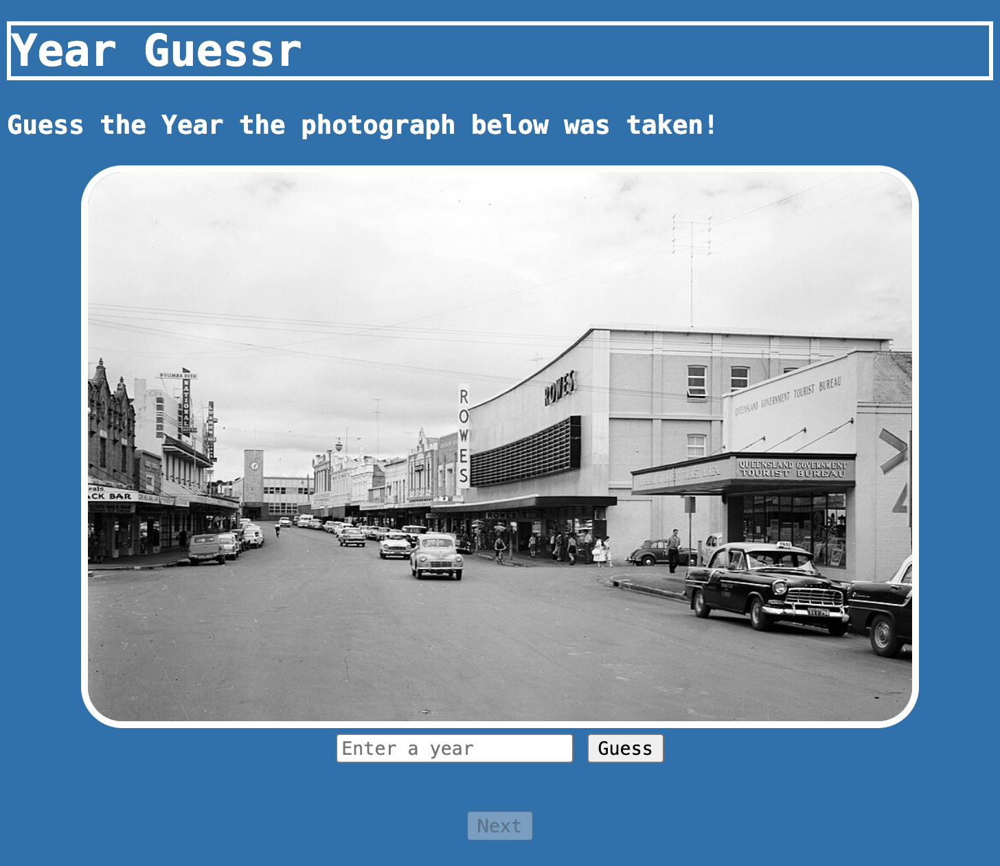

**Overview**
YearGuessr is a web game that lets you guess the age of a photograph in three trys! (This Project is for Hackclub #horizons, more info at https://horizons.hackclub.com/).

**What it does & How to use it**
YearGuessr is pretty simple to use. The website spawns an image on the webpage and your job is to determine what year the photograph was taken in three trys. The website also gives you feedback if the photgraph was taken later or earlier than your guess. If you guess wrong three times you won't be able to guess again and you'll have to click on the "next" button to receive the next photograph.

**How it Works**
In the following I will describe the workflow of the page: When type your guess in the input bar and click on the guess button, your input will be compared to the correct year in the checkGuess() function in index.js. If your guess was correct you will receive a "correct!" message on the screen. If your guess wasn't correct, index.js will return if the year was earlier or later than you guessed. When the round is over and you click on the "next" button, the loadNextImage() function gets triggered giving you the next round. Alongside this, the checkAvailability function gets triggered determining if and if yes how many photographs there are to guess.

**Tech Stack**
I am using is the "foundational Frontend Stack". (Basic HTML, CSS, and JavaScript)

**Motivation**
My friends and classmates have lately been obsessed with the web game GeoGuessr, a game where you guess the location of a google maps street view location on the in game world map. I really liked the idea of making my own game like geoguessr, but not a clone but something different: Geoguessr with another dimension: Time! Thus YearGuessr was born.

**Screenshot**
